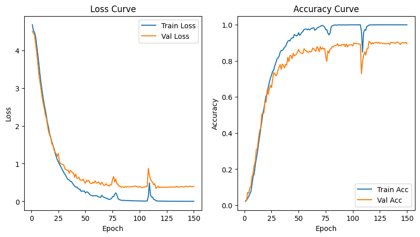

# LIS_Kaggle
# Multimodal Gesture Classification using RGB and Radar Data

This project addresses the challenge of classifying 126 Italian Sign Language (LIS) gestures by leveraging both visual and radar modalities. It was developed for a Kaggle competition on multimodal learning, and implements a late fusion strategy with temporal modeling using an LSTM network.

## 🔍 Problem Overview

The goal is to recognize LIS gestures performed by different individuals using synchronized RGB video and radar recordings. The dataset is multimodal and requires learning temporal patterns from each modality while effectively combining them for improved performance.

## 🧠 Approach

I use a **late fusion strategy**:
- RGB and radar data are processed independently to extract features.
- Features from both modalities are concatenated.
- A temporal model (LSTM) captures gesture dynamics across time.
- The final output is a gesture classification among 126 classes.

## 📦 Dataset

The dataset consists of:
- RGB video recordings of LIS gestures.
- Radar video signals aligned with RGB.
- Each sample belongs to one of 126 gesture classes.

I preprocess the data as follows:
- Extract **up to 30 frames** from each RGB and radar video. If a video has fewer than 30 frames, we **pad** with zeros.
- Extract features from each frame using:
  - **ResNet50** for RGB
  - A **custom CNN** for radar
- Save features as `.npy` files.
- Use a JSON file to store the original (unpadded) sequence lengths for proper LSTM training with `pack_padded_sequence`.

## 🧪 Fusion Strategy

We explored:
- **Early fusion** (concatenating raw frames): discarded due to alignment issues.
- **Late fusion** (concatenating features): selected as final method.
- **Attention-based fusion**: considered for future work.

## 🏗️ Architecture

- **Feature extractors**:  
  - RGB → ResNet50 → 2048-dim  
  - Radar → Custom CNN → 96-dim  
- **Fusion**: `[RGB | Radar] → 2144-dim`
- **Temporal model**: 2-layer **LSTM**
- **Classifier**: Fully connected + softmax (126 classes)

## 📈 Results

| Metric     | Score |
|------------|-------|
| Accuracy   | 90.30% |
| Best Epoch | 116    |



## 📁 Folder Structure

├── features_RGB/ # Extracted RGB features (train/val/test)

├── features_radar/ # Extracted radar features (train/val/test)

├── lengths_train.json # Lengths for train samples

├── lengths_val.json # Lengths for validation samples

├── model/ # LSTM model definition

├── dataset.py # Dataset and dataloader

├── train.py # Training loop

└── README.md # This file

## 📊 Training

- Optimizer: Adam  
- Loss: CrossEntropyLoss  
- Batch size: 64  
- Sequence padding: Enabled  
- Packed sequences: Used to handle variable-length input  
- Framework: PyTorch

## 🧹 Preprocessing Notes

- Maximum frames per video: **30**
- Padded with zeros if fewer than 30 frames
- JSON dictionary maps `SAMPLE_x` → original number of frames
- During training, lengths are capped at 30:  
  ```python
  length = min(length, 30)


## 📌 Future Improvements
- Implement attention-based fusion  
- Add end-to-end training (joint feature extraction + LSTM)  
- Explore transformer-based temporal models  

## ✍️ Authors
Matteo Cacioppo – MSc Physics & ML enthusiast  
This work was submitted as part of a Kaggle competition on multimodal learning.

@inproceedings{mineo2024sign,
  title={Sign Language Recognition for Patient-Doctor Communication: A Multimedia/Multimodal Dataset},
  author={Mineo, Raffaele and Caligiore, Gaia and Spampinato, Concetto and Fontana, Sabina and Palazzo, Simone and Ragonese, Egidio},
  booktitle={2024 IEEE 8th Forum on Research and Technologies for Society and Industry Innovation (RTSI)},
  pages={202--207},
  year={2024},
  organization={IEEE}
}

@inproceedings{caligiore-etal-2024-multisource,
  title = {Multisource Approaches to Italian Sign Language ({LIS}) Recognition: Insights from the MultiMedaLIS Dataset},
  author = {Caligiore, Gaia and Mineo, Raffaele and Spampinato, Concetto and Ragonese, Egidio and Palazzo, Simone and Fontana, Sabina},
  editor = {DellOrletta, Felice and Lenci, Alessandro and Montemagni, Simonetta and Sprugnoli, Rachele},
  booktitle = {Proceedings of the 10th Italian Conference on Computational Linguistics (CLiC-it 2024)},
  month = dec,
  year = {2024},
  address = {Pisa, Italy},
  publisher = {CEUR Workshop Proceedings},
  url = {https://aclanthology.org/2024.clicit-1.17/},
  pages = {132--140},
  ISBN = {979-12-210-7060-6}
}

@inproceedings{mineo2025radar,  
  title={Radar-Based Imaging for Sign Language Recognition in Medical Communication},  
  author={Mineo, Raffaele and Caligiore, Gaia and Proietto Salanitri, Federica and Kavasidis, Isaak and Polikovsky, Senya and Fontana, Sabina and Ragonese, Egidio and Spampinato, Concetto and Palazzo, Simone},  
  booktitle={International Conference on Medical Image Computing and Computer-Assisted Intervention},  
  year={2025},  
  organization={Springer}  
}


## 🏁 License
This project is licensed under the MIT License.


